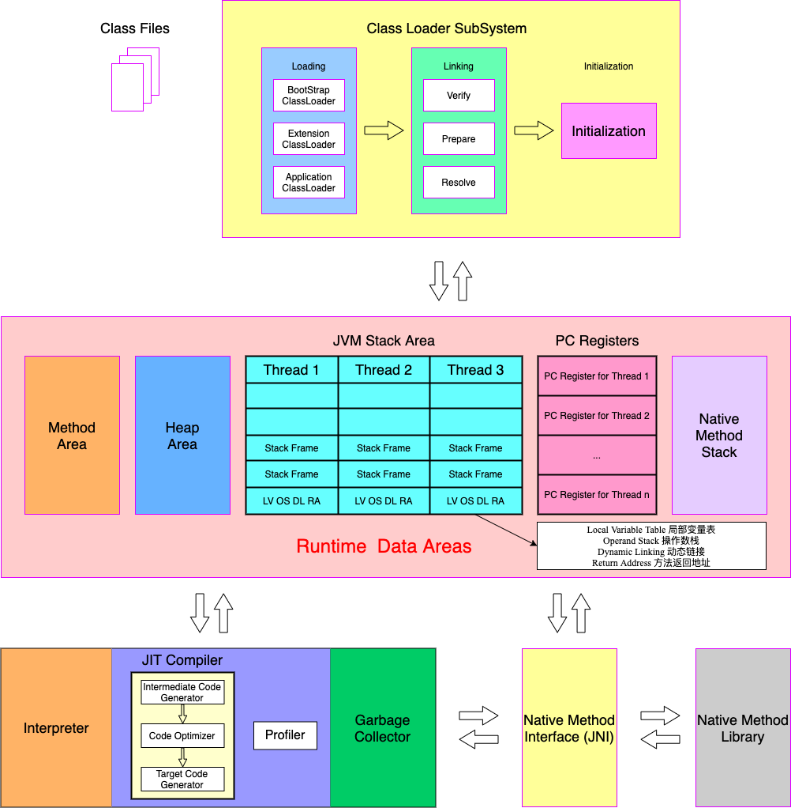

# 02_类加载子系统

## 1 - 内存结构概述

JVM 架构简图

---

JVM 架构 英文

---

JVM 架构中文

## 2 - 类加载器与类的加载过程

### 类加载子系统作用

- 类加载子系统负责从文件系统或者网络中加载 Class 文件，Class 文件在文件开头有特定的文件标识（cafebabe）
- ClassLoader 只负责 Class 文件的加载，至于它是否能够运行，则由 Execution Engine 决定
- 加载的类信息存放于一块称为方法区的内存空间。除了类的信息外，方法区还存放运行时常量池信息，可能还包含字符串字面值和数字常量（这部分常量信息是 Class 文件中常量池部分的内存映射）

### 类加载器的角色

- class file 存放于本地硬盘上，可以理解成设计师画在纸上的模板，最终这个模板在执行的时候要加载到 JVM 中来，根据这个文件实例化出 n 个一模一样的实例
- class file 加载到 JVM 中，被称为 DNA 原数据模板，放在方法区
- 在 class 文件 -> JVM -> 最终成为原数据模板，此过程需要一个运输工具，即类加载器 Class Loader，扮演一个快递员的角色

 ### 类的加载过程

#### Loading 阶段

1. 通过一个类的全限定名获取定义此类的二进制字节流

2. 将这个字节流所代表的的静态存储结构转化为方法区的运行时数据区

3. **在内存中生成一个代表这个类的 java.lang.Class 对象**，作为方法区这个类的各种数据的访问入口

补充：加载 class 文件的方式

- 从本地系统中直接加载
- 通过网络获取，典型场景：Web Applet
- 从 zip 压缩包中读取，成为日后 jar、war 格式的基础
- 运行时计算生成，使用最多的是：动态代理技术
- 由其他文件生成，典型场景：JSP 应用
- 从专有数据库中提取 class 文件，比较少见
- 从加密文件中获取，典型的防 class 文件被反编译的保护措施

#### Linking 阶段

1.验证（Verify）：
- 目的在于确保 class 文件的字节流中包含信息符合当前虚拟机要求，保证被加载类的正确性，不会危害虚拟机的自身安全
- 主要包括四种验证：文件格式验证，元数据验证，字节码验证，符号引用验证

2.准备（Prepare）：

- 为类变量分配内存并且设置该类变量的默认初始值，即零值
- 这里不包含用 final 修饰的 static，因为 final 在编译的时候就会分配了，准备阶段会显示初始化
- 这里不会为实例变量分配初始值，类变量会分配在方法区中，而实例变量是会随着对象一起分配到 Java 堆中

3.解析（Resolve）：

- 将常量池内的符号引用转换为直接引用的过程
- 事实上，解析操作往往会伴随着 JVM 在执行完初始化之后再执行
- 符号引用就是一组符号来描述所引用的目标。符号引用的字面量形式明确定义在《Java 虚拟机规范》的 class 文件格式中。直接引用就是直接指向目标的指针、相对偏移量或者一个间接定位到目标的句柄
- 解析动作主要针对类或接口、字段、类方法、接口方法、方法类型等。对应常量池中的 CONSTANT_Class_info、CONSTANT_Fieldref_info、CONSTANT_Methodref_info 等。

#### Initialization 阶段

- 初始化阶段就是执行类构造器方法 `<clinit>()` 的过程
- 此方法不需要定义，是 javac 编译器自动收集类中所有类变量的赋值动作和静态代码块中的语句合并而来
- 构造器方法中指令按语句在源文件中出现的顺序执行
- `<clinit>()` 不同于类的构造器。（关联：构造器是虚拟机视角下的 `<init>()`）
- 若该类具有父类，JVM 会保证子类的 `<clinit>()` 执行前，父类的 `clinit()` 已经执行完毕
- 虚拟机必须保证一个类的 `clinit()` 方法在多线程下被同步加载

## 3 - 类加载器分类

- JVM 支持两种类型的类加载器，分别为引导类加载器（Bootstrap Class Loader）和自定义类加载器（User Defined Class Loader）
- 从概念上来讲，自定义类加载器一般指的是程序中由开发人员自定义的一类类加载器，但是 Java 虚拟机规范中却没有这么定义，而是将所有派生于抽象类 ClassLoader 的类加载器都划分为自定义类加载器
- 无论类加载器的类型如何划分，在程序中，我们最常见的类加载器始终只有 3 个，如下所示：

这里的四者之间的关系是包含关系。不是上下层，也不是子父类的继承关系。

### 虚拟机自带的加载器

- 启动类加载器（引导类加载器，Bootstrap ClassLoader）
  - 这个类加载器使用 C/C++ 语言实现的，嵌套在 JVM 内部
  - 它用来加载 Java 的核心库（JAVA_HOME/jre/lib/rt.jar、resources.jar 或 sun.boot.class.path 路径下的内容），用于提供 JVM 自身需要的类
  - 并不继承自 java.lang.ClassLoader，没有父加载器。
  - 加载拓展类和应用程序类加载器，并指定为他们的父类加载器
  - 出于安全考虑，Bootstrap 启动类加载器只加载包名为 java、javax、sun 等开头的类
- 拓展类加载器（Extension ClassLoader）
  - Java 语言编写，由 sun.misc.Launcher$ExtClassLoader 实现
  - 派生于 ClassLoader 类
  - 父类加载器为启动类加载器
  - 从 java.ext.dirs 系统属性所指定的目录中加载类库，或从 JDK 的安装目录的 jre/lib/ext 子目录（拓展目录）下加载类库。如果用户创建的 JAR 放在此目录下，也会自动由拓展类加载器加载
- 应用程序类加载器（系统类加载器，AppClassLoader）
  - java 语言编写，由 sun.misc.Launcher$AppClassLoader 实现
  - 派生于 ClassLoader 类
  - 父类加载器为拓展类加载器
  - 他负责加载环境变量 classpath 或系统属性 java.class.path 指定路径下的类库
  - 该类加载是程序中默认的类加载器，一般来说，Java 应用的类都是由它来完成加载
  - 通过 ClassLoader$getSystemClassLoader() 方法可以获取到该类加载器

### 用户自定义类加载器

- 在 Java 的日常应用程序开发中，类的加载几乎是由上述 3 种类加载器相互配合执行的，在必要时，我们还可以自定义类加载器，来定制类的加载方式
- 为什么要自定义类加载器
  - 隔离加载类
  - 修改类加载方式
  - 拓展加载源
  - 防止源码泄露

### 用户自定义类加载器实现步骤

- 开发人员可以通过继承抽象类 java.lang.ClassLoader 类的方式，实现自己的类加载器，以满足一些特殊需求
- 在 JDK 1.2 之前，在自定义类加载器时，总会去继承 ClassLoader 类并重写 loadClass() 方法，从而实现自定义的类加载器类，但是在 JDK 1.2 之后已不再建议用户去覆盖 loadClass() 方法，而是建议把自定义的类加载逻辑写在 findClass() 方法中
- 在编写自定义类加载器时，如果没有太过于复杂的需求，可以直接继承 URLClassLoader 类，这样就可以避免自己去编写 findClass() 方法以及获取字节码流的方式，使自定义类加载器编写更加简单

## 4 - 类加载器的使用说明

### 关于 ClassLoader

ClassLoader 类，它是一个抽象类，其后所有的类加载器都继承自 ClassLoader （不包括启动类加载器）

| 方法名称                                             | 描述                                                         |
| ---------------------------------------------------- | ------------------------------------------------------------ |
| getParent()                                          | 返回该类加载器的超类加载器                                   |
| loadClass(String name)                               | 加载名称为 name 的类，返回结果为 java.lang.Class 类的实例    |
| findClass(String name)                               | 查找名称为 name 的类，返回结果为 java.lang.Class 类的实例    |
| findLoadedClass(String name)                         | 查找名称为 name 的已经被加载过的类，返回结果为 java.lang.Class 类的实例 |
| defineClass(String name, byte[] b, int off, int len) | 把字节数组 b 中的内存转换成为一个 Java 类，返回结果为 java.lang.Class 类的实例 |
| resolveClass(Class<?> c)                             | 连接指定的一个 Java 类                                       |

### 获取 ClassLoader 的途径

方式一：获取当前类的 ClassLoader

clazz.getClassLoader()

方式二：获取当前线程上下文的 ClassLoader

Thread.currentThread().getContextClassLoader()

方式三：获取系统的ClassLoader

ClassLoader.getSystemClassLoader()

方式四：获取调用者的 CLassLoader

DriverManager.getCallerClassLoader()

## 5 - 双亲委派机制

Java 虚拟机对 class 文件采用的是按需加载的方式，也就是说当需要使用该类时才会将它的 class 文件加载到内存生成 class 对象。而且加载某个类的 class 文件时，Java 虚拟机采用的是双亲委派模式，即把请求交由父类处理，它是一种任务委派模式。

### 工作原理

- 如果一个类加载器收到了类加载的请求，它并不会自己先去加载，而是把这个请求委托给父类的加载器去执行
- 如果父类加载器还存在其他父类加载器，则进一步向上委托，依次递归请求最终将到达顶层的启动类加载器
- 如果父类加载器可以完成类的加载任务，就成功返回，倘若父类加载器无法完成此加载任务，子加载器才会尝试自己去加载，这就是双亲委派机制

### 优势

- 避免类的重复加载
- 保护程序安全，防止核心 API 被随意篡改

### 沙箱安全机制

自定义 String 类，但是在加载自定义 String 类的时候会率先使用引导类加载器加载，而引导类加载器在加载过程中会率先加载 JDK 自带的文件（rt.jar 包中 java/lang/String.class），报错信息说没有 main 方法，就是因为加载的是rt.jar 包中的 String 类。这样可以保证对 Java 核心源代码的保护，这就是沙箱安全机制。

## 6 - 其他

在 JVM 中表示两个 class 对象是否为同一个类存在两个必要条件：

- 类的完整类名必须一致，包括包名
- 加载这个类的 ClassLoader （指 ClassLoader 实例对象）必须相同

换句话说，在 JVM 中，即使这两个类对象（class 对象）来源于同一个 Class 文件，被同一个虚拟机所加载，但只要加载它们的 ClassLoader 实例对象不同，那么这两个类对象也是不相等的。

### 对类加载器的引用

JVM 必须知道一个类型是由启动加载器加载的还是由用户类加载器加载的。如果一个类型是由用户类加载器加载的，那么 JVM 会将这个类加载器的一个引用作为类型信息的一部分保存在方法区中。当解析一个类型到另一个类型的引用的时候，JVM 需要保证这两个类型的类加载器是相同的。

### 类的主动使用和被动使用

Java 程序对类的使用方式分为：主动使用和被动使用。

- 主动使用，又分为七种情况
  - 创建类的实例
  - 访问某个类或接口的静态变量，或者对该静态变量赋值
  - 调用类的静态方法
  - 反射（比如： Class.forName("com.atguigu/Test")）
  - 初始化一个类的子类
  - Java 虚拟机启动时被标明为启动类的类
  - JDK 7 开始提供的动态语言支持（java.lang.invoke.MethodHandle 实例的解析结果 REF_getStatic、REF_putStatic、REF_invokeStatic 句柄对应的类没有初始化，则初始化）
- 除了以上七种情况，其他使用 Java 类的方式都被看做是对类的被动使用，都不会导致类的初始化