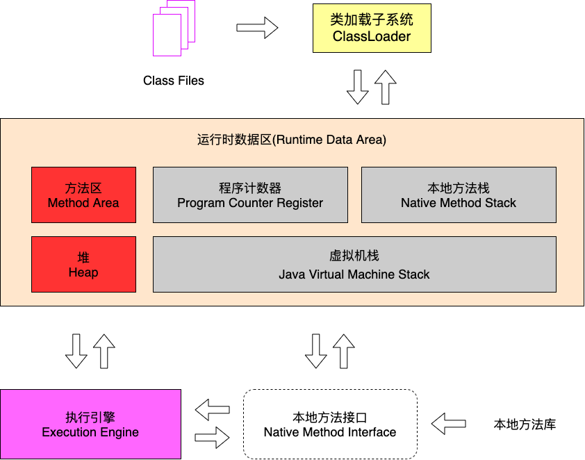

# 03_运行时数据区概述及线程

## 运行时数据区概述

内存是非常重要的系统资源，是硬盘和 CPU 的中间仓库及桥梁，承载着操作系统和应用程序的实时运行。JVM 内存布局规定了 Java 在运行过程中内存申请、分配、管理的策略，保证了 JVM 的高效稳定运行。不同的 JVM 对于内存的划分方式和管理机制存在着部分差异。结合 JVM 虚拟机规范，来讨论一下经典的 JVM 内存布局。

Java 虚拟机定义了若干种程序运行期间会使用到的运行时数据区，其中有一些会随着虚拟机启动而创建，随着虚拟机退出而销毁。而另外一些则是与线程一一对应的，这些与线对应的数据区域会随着线程开始和结束而创建和销毁。

## 线程

线程是一个程序里的运行单元。JVM 允许一个应用有多个线程并行的执行

在 HotSpot 虚拟机里，每个线程都与操作系统的本地线程直接映射。当一个 Java 线程准备好执行以后，此时一个操作系统的本地线程也同时创建。Java 线程执行终止后，本地线程也会回收

操作系统负责所有的线程的安排调度到任何一个可用的 CPU 上。一旦本地线程初始化成功，它就会调用 Java 线程中的人run() 方法

### JVM 系统线程

如果你使用 jconsole 或者是任何一个调试工具，都能看到在后台有许多线程在运行。这些后台线程不包括调用 public static void main(String[] args) 的 main 线程以及所有这个 main 线程自己创建的线程。

这些主要的后台系统线程在 HotSpot 虚拟机里主要是以下几个

- 虚拟机线程：这种线程的操作是需要 JVM 达到安全点才会出现。这些操作必须在不同的线程中发生的原因是他们都需要 JVM 达到安全点，这样堆才不会变化。这种线程的执行类型包括“stop-the-world”的垃圾收集，线程栈收集，线程挂起以及偏向锁撤销
- 周期任务线程：这种线程是时间周期事件的体现（比如中断），他们一般用于周期性操作的调度执行
- GC 线程：这种线程对在 JVM 里不同种类的垃圾收集行为提供了支持
- 编译线程：这种线程在运行时会将字节码编译成本地代码
- 信号调度线程：这种线程接收信号并发送给 JVM，在它内部通过调用适当的方法进行处理

