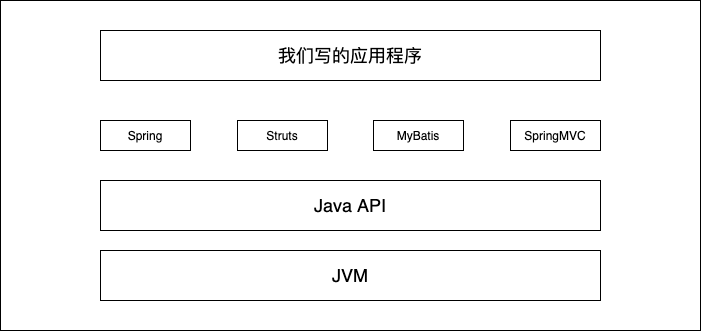
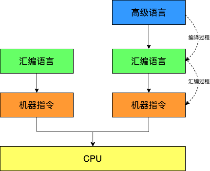
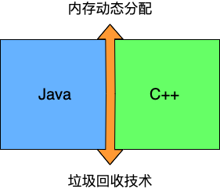
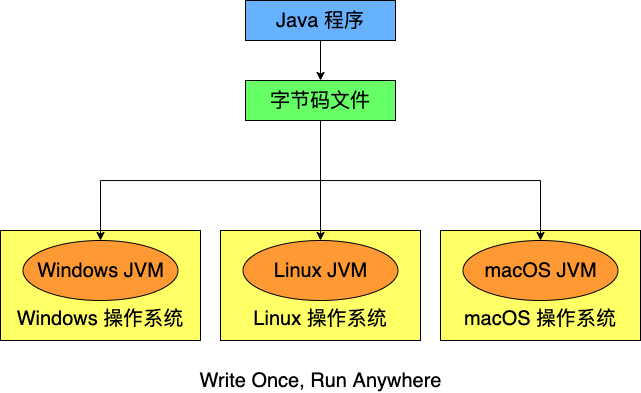
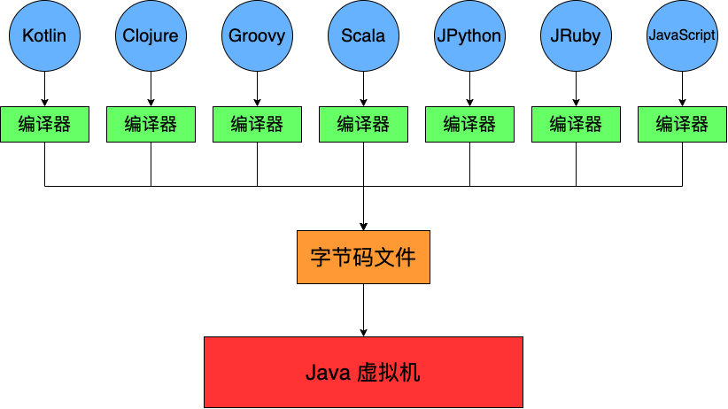
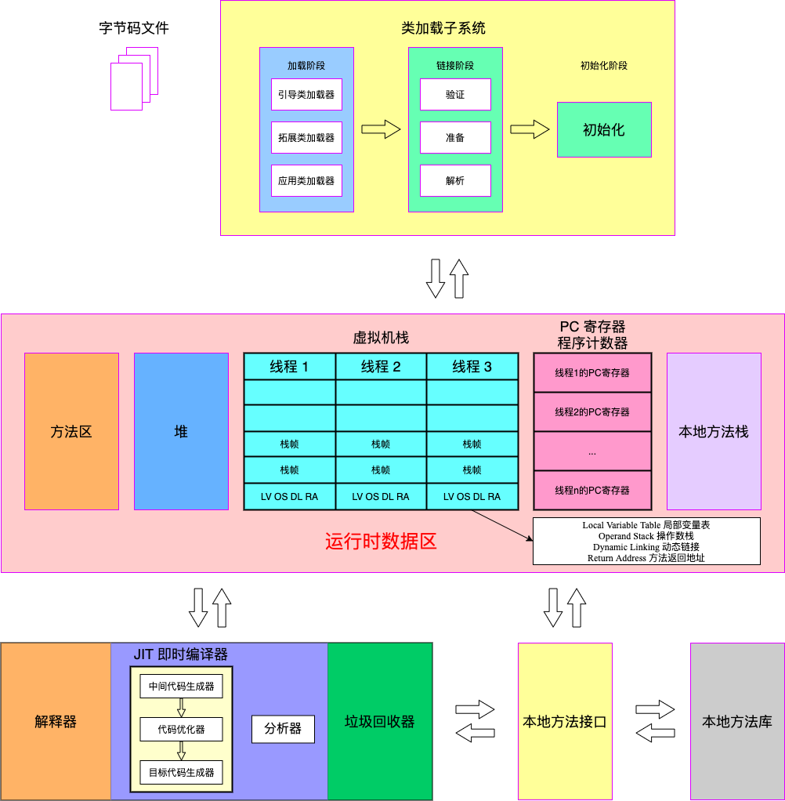

# 01_JVM与Java体系结构

## 1 - 前言

> 作为 Java 工程师的你，曾被 JVM 伤害过吗？

### 你是否也遇到过这样的问题？
- 运行着的线上系统突然开始，系统无法访问，甚至直接报 OOM！
- 想解决线上 GC 问题，却又无从下手；
- 新项目上线，对各种 JVM 参数的设置一脸茫然，直接默认吧，然后就 JJ 了；
- 每次面试之前都需要重新背一遍 JVM 的一些原理概念性的东西，然而面试官却经常问你在实际项目中如何调优 JVM 参数，如何解决 GC、OOM 等问题，一脸懵逼。



大部分 Java 开发人员，除会在项目中使用到与 Java 平台相关的各种高精尖技术，对于 Java 技术的核心 Java 虚拟机了解甚少。

### 开发人员如何看待上层框架
- 一些有一定工作经验的开发人员，打心眼里觉得 SSM、微服务等上层技术才是重点，基础技术并不重要，这其实是一种本末倒置的“病态”。
- 如果我们把核心类库 API 比做数学公式的话，那么 Java 虚拟机的知识就好比公式的推导过程。



计算机系统体系对我们来说越来越远，在不了解底层实现的前提下，通过高级语言很容易的编写代码。但事实上计算机并不认识高级语言。

### 架构师每天都在思考什么
- 应该如何让我的系统更快？
- 如何避免系统出现瓶颈？

知乎上有条帖子：应该如何看待招聘信息，直通年薪50w+?
- 参与现有系统的性能优化，重构，保证平台性能和稳定性；
- 根据业务和场景需求，决定技术方向，做技术选型；
- 能够独立架构和设计海量数据下高并发分布式解决方案，满足功能和非功能需求；
- 解决各类系统潜在风险，核心功能的架构和代码编写；
- 分析系统瓶颈，解决各种疑难杂症，性能调优等。

### 为什么学习JVM
- 面试的需要
- 中高级程序员必备技能（项目管理、调优的需要）
- 追求极客精神（比如：垃圾回收算法、JIT、底层原理）

### Java vs C++



垃圾回收机制为我们打理了很多繁琐的工作，大大提高了开发效率，但是垃圾收集也不是万能的，懂得 JVM 内部的内存结构、工作机制，是设计高拓展性应用和诊断运行时问题的基础，也是 Java 工程师进阶的必备能力。

## 2 - 面向人群及参考书目

### 面向人群
- 拥有一定开发经验的 Java 平台开发人员
- 软件设计师、架构师
- 系统调优人员
- 有一定的 Java 编程基础，并希望进一步理解 Java 的程序员
- 虚拟机爱好者、JVM 实践者

### 课程
- 理论 多于 代码
- 通俗、易懂、说人话
- 图解

### 书和文档
- 【推荐】官网：https://docs.oracle.com/javase/specs/index.html
- 【推荐】深入理解 Java 虚拟机
- Java 虚拟机规范
- 实战 Java 虚拟机
- Java 虚拟机精讲
- 码出高效 Java 开发手册

## 3 - Java 及 JVM 简介

[TIOBE 语言热度排行榜](https://www.tiobe.com/tiobe-index/)

世界上没有最好的编程语言，只有最适用于具体应用场景的编程语言。

### Java 生态圈

Java 是目前应用最为广泛的软件开发平台之一。随着 Java 以及 Java 社区的不断壮大，Java 也早已不再是简简单单的一门计算机语言了，它更是一个平台、一种文化、一个社区。
- 作为一个平台：Java 虚拟机扮演着举足轻重的作用。
  - Groovy、Scala、JRuby、Kotlin 等都是 Java 平台的一部分。
- 作为一种文化：Java 几乎成为了开源的代名词
  - 第三方开源软件和框架，如，Tomcat、Struts、MyBatis、Spring 等
  - 就连 JDK 和 JVM 自身也有不少开源的实现，如 OpenJDK、Harmony
- 作为一个社区，Java 拥有全世界最多的技术拥护者和开源社区的支持，有数不清的论坛和资料。从桌面应用软件、嵌入式开发到企业级应用、后台服务器、中间件，都可以看到 Java 的身影。其应用形式之复杂、参与人数之众也令人咋舌。

### Java 跨平台的语言



### Java 虚拟机规范

The Java Virtual Machine is the cornerstone of the Java platform. **It is the component of the technology responsible for its hardware- and operating system-independence**, the small size of its compiled code, and its ability to protect users from malicious programs.

The Java Virtual Machine is an abstract computing machine. Like a real computing machine, it has an instruction set and manipulates various memory areas at run time. It is reasonably common to implement a programming language using a virtual machine; the best-known virtual machine may be the P-Code machine of UCSD Pascal.

### JVM 跨语言的平台



随着 Java 7 的正式发布，Java 虚拟机的设计者们通过 JSR-292 规范基本实现在 Java 虚拟机平台上运行非 Java 语言编写的程序。

Java 虚拟机根本不关心运行在其内部的程序到底是使用何种编程语言编写的，它只关心“字节码”文件。也就是说，Java 虚拟机拥有语言无关性，并不会单纯地与 Java 语言“终身绑定”，只要其他编程语言的编译结果满足并包含 Java 虚拟机的内部指令集，符号表以及其他的辅助信息，他就是一个有效的字节码文件，就能够被虚拟机所识别并装载运行。

### 字节码

- 我们平时所说的 Java 字节码，指的是用 Java 语言编译成的字节码。准确的说能在 JVM 平台上执行的字节码格式都是一样的。所以应该统称为 JVM 字节码。
- 不同的编译器，可以编译出相同的字节码文件，字节码文件也可以在不同的 JVM 上运行。
- Java 虚拟机与 Java 语言并没有必然的联系，它只与特定的二进制文件格式 .class 文件格式所关联，.class 文件中包含了 Java 虚拟机指令集（或者称为字节码、Bytecodes）和符号表，还有一些其他的辅助信息。

### 多语言混合编程

Java 平台上的多语言混合编程正在成为主流，通过特定领域的语言去解决特定领域的问题是当前软件开发应对日趋复杂的项目需求的一个方向。

试想一下，在一个项目之中，并行处理使用 Clojure 语言编写，展示层使用 JRuby/Rails，中间层则是 Java，每个应用层都将使用不同的编程语言来完成，而且，接口对每一层开发者都是透明的，各种语言之间的交互不存在任何困难，就像使用自己语言的原生 API 一样方便，因为他们最终都运行在一个虚拟机之上。

对于这些运行在虚拟机之上、Java 语言之外的语言，来自系统级的、底层的支持正在迅速增强，以 JSR-292 为核心的一系列项目和功能改进（如，Davinci Machine 项目、Nashorn 引擎、InvokeDynamic 指令、java.lang.invoke 包等），推动 Java 虚拟机从 Java 语言的虚拟机向多语言虚拟机发展。

## 4 - Java 发展的重大事件

## 5 - 虚拟机与 Java 虚拟机

## 6 - JVM 的整体结构

## 7 - Java 代码的执行流程


## 8 - JVM的结构模型

### 两种架构

Java 编译器输入的指令流基本上是一种基于栈的指令集架构，另外一种指令集架构则是基于寄存器的指令集架构。

具体来说两种架构之间的区别：

- 基于栈式架构的特点
  - 设计和实现更简单，适用于资源受限的系统；
  - 避开了寄存器的分配难题：使用零地址指令方式分配；
  - 指令流中的指令大部分是零地址指令，其执行过程依赖于操作数。指令集更小，编译器容易实现；
  - 不需要硬件支持，可移植性更好，更好实现跨平台。
- 基于寄存器架构的特点
  - 典型的应用是 x86 的二进制指令集：比如传统的 PC 以及 Android 的 Davlik 虚拟机；
  - 指令集架构则完全依赖硬件，可移植性差；
  - 性能优秀和执行更高效；
  - 花费更少的指令去完成一项操作；
  - 在大部分情况下，基于寄存器架构的指令集往往都是一地址指令、二地址指令和三地址指令为主，而基于栈式架构的指令集却是以零地址指令为主。

### 举例1：

同样执行 2+3 这种逻辑操作，其指令分别如下：

基于栈的计算流程（以 Java 虚拟机为例）：

```
iconst_2 // 常量 2 入栈
istore_1
iconst_3 // 常量 3 入栈
istore_2
iload_1
iload_2
iadd     // 常量 2、3 出栈，执行相加
istore_0 // 结果 5 入栈
```

而基于寄存器的计算流程

```
mov eax,2  // 将 eax 寄存器的值设置为 2
mov eax,3  // 使 eax 寄存器的值加 3
```

代码演示一下

```java
public class StackStruTest {
    public static void main(String[] a) {
        int i = 2 + 3;
    }
}
```

```
cd chapter_01
javac StackStruTest.java
javap -v StackStruTest
Classfile /Users/yonghong/Coding/jvm/song/chapter_01/StackStruTest.class
  Last modified 2020-11-17; size 277 bytes
  MD5 checksum 9a7da6f68b8101238c5ab826d90154c5
  Compiled from "StackStruTest.java"
public class StackStruTest
  minor version: 0
  major version: 52
  flags: ACC_PUBLIC, ACC_SUPER
Constant pool:
   #1 = Methodref          #3.#12         // java/lang/Object."<init>":()V
   #2 = Class              #13            // StackStruTest
   #3 = Class              #14            // java/lang/Object
   #4 = Utf8               <init>
   #5 = Utf8               ()V
   #6 = Utf8               Code
   #7 = Utf8               LineNumberTable
   #8 = Utf8               main
   #9 = Utf8               ([Ljava/lang/String;)V
  #10 = Utf8               SourceFile
  #11 = Utf8               StackStruTest.java
  #12 = NameAndType        #4:#5          // "<init>":()V
  #13 = Utf8               StackStruTest
  #14 = Utf8               java/lang/Object
{
  public StackStruTest();
    descriptor: ()V
    flags: ACC_PUBLIC
    Code:
      stack=1, locals=1, args_size=1
         0: aload_0
         1: invokespecial #1                  // Method java/lang/Object."<init>":()V
         4: return
      LineNumberTable:
        line 2: 0

  public static void main(java.lang.String[]);
    descriptor: ([Ljava/lang/String;)V
    flags: ACC_PUBLIC, ACC_STATIC
    Code:
      stack=1, locals=2, args_size=1
         0: iconst_5 // 直接返回了 5
         1: istore_1
         2: return
      LineNumberTable:
        line 4: 0
        line 5: 2
}
SourceFile: "StackStruTest.java"
```

改一下代码

```java
public class StackStruTest {
    public static void main(String[] a) {
        // int i = 2 + 3;
        int i = 2;
        int j = 3;
        int k = i + j;
    }
}
```

重新查看，发现还是被优化了

```

```

### 总结

由于跨平台的设计，Java 的指令都是根据栈来设计的。不同平台 CPU 架构不同，所以不能设计为基于寄存器的。优点是跨平台、指令集小，编译器容易实现；缺点是性能下降，实现同样的功能需要更多的指令。

时至今日，尽管嵌入式平台已经不是 Java 程序的主流运行平台了（准确来说是 HotSpot 虚拟机的宿主环境已经不局限于嵌入式平台了），那么为什么不将架构更换为基于寄存器的架构呢？

答：基于栈式架构的虚拟机跨平台、指令集小，编译器容易实现，在非资源受限的场景中也是可以使用的。

## 9 - JVM 的生命周期

### 虚拟机的启动

Java 虚拟机的启动时通过引导类加载器（bootstrap class loader）创建一个初始类（initial class）来完成的，这个类是由虚拟机的具体实现指定的。

### 虚拟机的执行

- 一个运行中的 Java 虚拟机有着一个清晰的任务：执行 Java 程序；
- 程序开始执行时他才运行，程序结束时他就停止；
- 执行一个所谓的 Java 程序的时候，真真正正在执行的是一个叫做 Java 虚拟机的进程。

### 虚拟机的退出

有如下的几种情况：
- 程序正常执行结束；
- 程序在执行过程中遇到了异常或错误而异常终止；
- 由于操作系统出现错误而导致 Java 虚拟机进程终止；
- 某线程调用 Runtime 类或 System 类的 exit 方法，或 Runtime 类的 halt 方法，并且 Java 安全管理器也允许这次 exit 或者 halt 操作；
- 除此之外，JNI（Java Native Interface）规范中描述了用 JNI Invocation API 来加载或卸载 Java 虚拟机时 Java 虚拟机的退出情况。

## 10 - JVM 发展历程

### Sun Classic VM
- 早在 1996 年 Java 1.0 版本的时候，Sun 公司发布了一款名为 Sun Classic VM 的 Java 虚拟机，它同时也是世界上第一款商用 Java 虚拟机，JDK 1.4 时完全被淘汰。
- 这款虚拟机内部只提供解释器。
- 如果使用 JIT 编译器，就需要进行外挂。但是一旦使用了 JIT 编译器，JIT 就会接管虚拟机的执行系统。解释器就不再工作。解释器和编译器不能配合工作。
- 现在 HotSpot 内置了此虚拟机。

### Exact VM
- 为了解决上一个虚拟机问题，JDK 1.2 时，Sun 提供了此虚拟机；
- Exact Memory Management: 准确式内存管理；
  - 也可以叫 Non-Conservative/Accurate Memory Management
  - 虚拟机可以知道内存中某个位置的数据具体是什么类型
- 具备现代高性能虚拟机的雏形
  - 热点探测
  - 编译器与解释器混合工作模式
- 只在 Solaris 平台短暂使用，其他平台上还是 Classic VM
  - 英雄气短，终被 HotSpot 虚拟机替换

### HotSpot
- HotSpot 历史
  - 最初由一家名为 Longview Technologies 的小公司设计
  - 1997 年，此公司被 Sun 收购；2009 年，Sun 公司被 Oracle 收购
  - JDK 1.3 时，HotSpot VM 成为默认虚拟机
- 目前 

